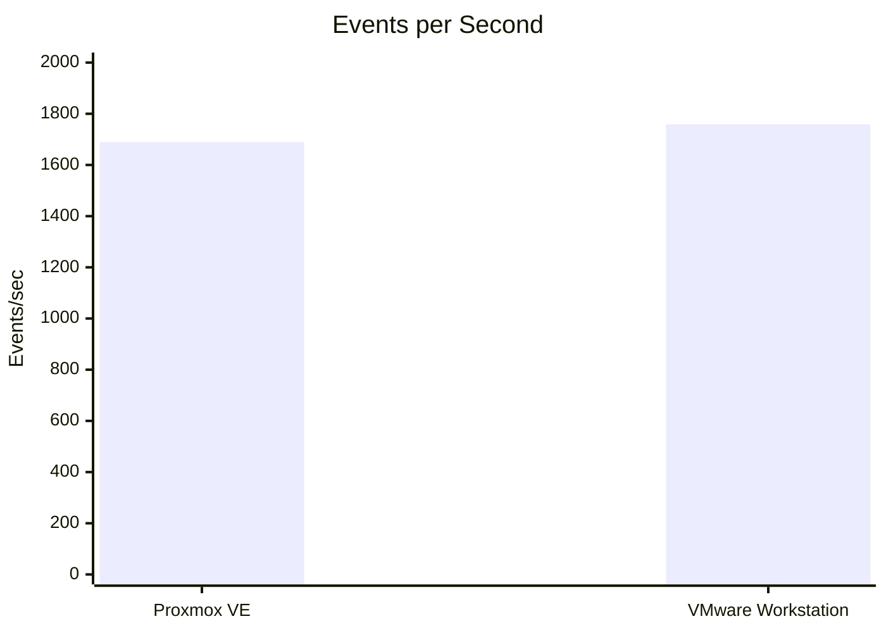
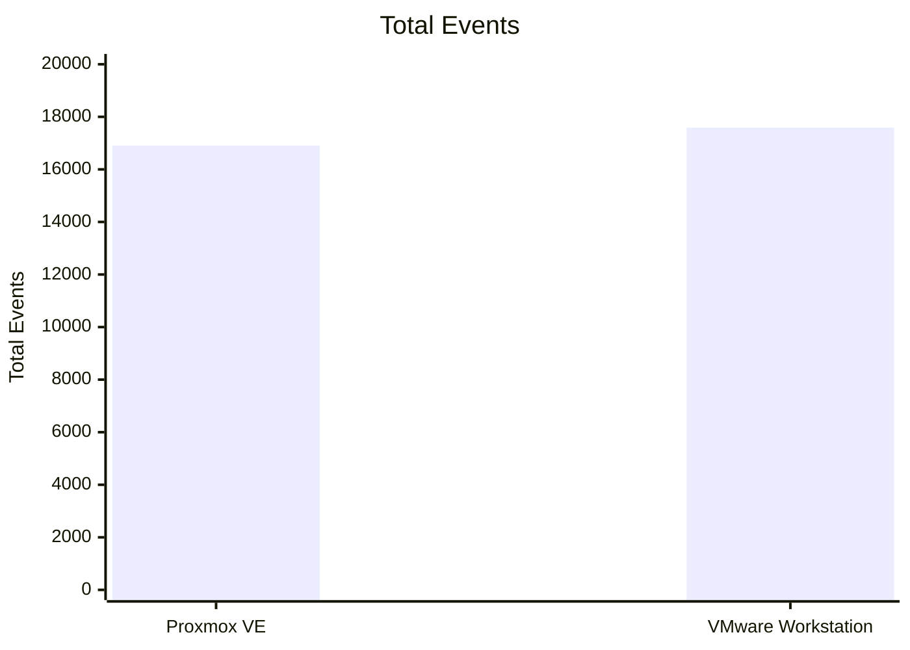
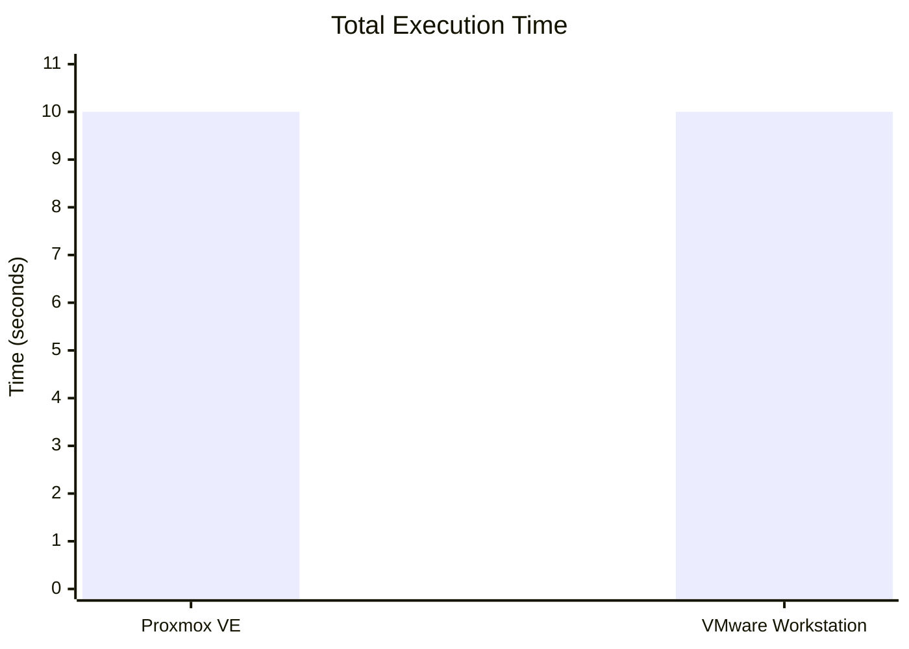

# Experiment 1 – Virtualization Performance Analysis

### Type-1 Hypervisor: Proxmox VE | Type-2 Hypervisor: VMware Workstation

## Objective

To study and analyze the performance of virtual machines using **Type-1 and Type-2 hypervisors** and compare their CPU performance using the **Sysbench CPU benchmarking tool**.

---

# 1. Overview

Virtualization allows multiple operating systems to run on the same physical hardware using a hypervisor. This experiment studies and compares two different approaches to virtualization:

* **Type-1 Hypervisor:** Proxmox VE
* **Type-2 Hypervisor:** VMware Workstation

An Ubuntu virtual machine was created and configured on both virtualization platforms. System resources were verified using Linux commands, and CPU performance was measured using Sysbench.

The experiment is divided into three major parts:

1. **Type-1 Hypervisor – Proxmox VE**
2. **Type-2 Hypervisor – VMware Workstation**
3. **Performance Comparison and Analysis**

---

# 2. Hypervisor Architecture

## 2.1 Type-1 Hypervisor – Proxmox VE

Proxmox VE is an open-source **Type-1 (bare-metal) hypervisor**. It runs directly on the physical hardware and provides an environment for creating and managing virtual machines.

```text
Physical Hardware
        │
        ▼
┌───────────────────────┐
│      Proxmox VE       │
│    Type-1 Hypervisor  │
└───────────┬───────────┘
            │
            ▼
┌───────────────────────┐
│      Ubuntu VM        │
│                       │
│  2 vCPU               │
│  2 GB RAM             │
│  20 GB Disk           │
└───────────────────────┘
```

The detailed Proxmox VE configuration, installation procedure, system verification, and benchmark procedure are provided in the separate **Type-1 Hypervisor – Proxmox VE** README.

---

## 2.2 Type-2 Hypervisor – VMware Workstation

VMware Workstation is a **Type-2 (hosted) hypervisor**. It runs on top of an existing host operating system and provides an environment for running virtual machines.

```text
Physical Hardware
        │
        ▼
┌───────────────────────┐
│   Host Operating      │
│       System          │
└───────────┬───────────┘
            │
            ▼
┌───────────────────────┐
│  VMware Workstation   │
│    Type-2 Hypervisor  │
└───────────┬───────────┘
            │
            ▼
┌───────────────────────┐
│      Ubuntu VM        │
│                       │
│  2 vCPU               │
│  8 GB RAM             │
│  20 GB Disk           │
└───────────────────────┘
```

The detailed VMware Workstation configuration, installation procedure, system verification, and benchmark procedure are provided in the separate **Type-2 Hypervisor – VMware Workstation** README.

---

# 3. Tools and Technologies

| Tool / Technology      | Purpose                            |
| ---------------------- | ---------------------------------- |
| **Proxmox VE**         | Type-1 virtualization              |
| **VMware Workstation** | Type-2 virtualization              |
| **Ubuntu**             | Guest operating system             |
| **Sysbench**           | CPU performance benchmarking       |
| **Linux Terminal**     | System verification and monitoring |

---

# 4. Virtual Machine Configuration

The configurations used for both virtual machines are summarized below.

| Parameter         | Type-1 – Proxmox VE | Type-2 – VMware Workstation |
| ----------------- | ------------------- | --------------------------- |
| Hypervisor        | Proxmox VE          | VMware Workstation          |
| Hypervisor Type   | Type-1              | Type-2                      |
| Guest OS          | Ubuntu 22.04        | Ubuntu 64-bit               |
| CPU               | 2 vCPU              | 2 vCPU                      |
| CPU Configuration | 1 Socket, 2 Cores   | 1 Processor, 2 Cores        |
| Memory            | 2 GB                | 8 GB                        |
| Disk              | 20 GB               | 20 GB                       |
| Network           | vmbr0 / VirtIO      | NAT                         |
| Benchmark         | Sysbench CPU        | Sysbench CPU                |

### Configuration Note

Both virtual machines were configured with **2 vCPUs and 20 GB disk space**. However, the memory allocation was different:

* Proxmox VE: **2 GB RAM**
* VMware Workstation: **8 GB RAM**

Therefore, the results represent the performance of the specific configurations used in this experiment.

---

# 5. Linux System Verification

The following commands were used inside the Ubuntu virtual machines to verify system information and monitor resource usage.

| Command       | Purpose                                            |
| ------------- | -------------------------------------------------- |
| `hostnamectl` | Displays hostname and operating-system information |
| `lscpu`       | Displays CPU and processor information             |
| `free -h`     | Displays memory usage                              |
| `df -h`       | Displays disk usage                                |
| `top`         | Monitors CPU, memory, and running processes        |

### Commands

```bash
hostnamectl
lscpu
free -h
df -h
top
```

---

# 6. Sysbench CPU Benchmark

Sysbench was used to evaluate CPU performance in both virtual machines.

## 6.1 Installation

```bash
sudo apt update
sudo apt install sysbench -y
sysbench --version
```

## 6.2 Benchmark Command

The same CPU benchmark was executed in both environments:

```bash
sysbench cpu --cpu-max-prime=20000 run
```

Using the same benchmark workload provides a common basis for comparing the measured results.

---

# 7. Type-1 Hypervisor Results – Proxmox VE

The following results were obtained from the Ubuntu VM running on Proxmox VE.

| Parameter            |        Result |
| -------------------- | ------------: |
| Hypervisor           |    Proxmox VE |
| Hypervisor Type      |        Type-1 |
| Guest OS             |        Ubuntu |
| CPU                  |        2 vCPU |
| Memory               |          2 GB |
| Disk                 |         20 GB |
| Total Execution Time | **10.0006 s** |
| Total Events         |    **16,903** |
| Events per Second    |  **1,689.43** |
| Minimum Latency      |   **0.57 ms** |
| Average Latency      |   **0.59 ms** |
| Maximum Latency      |   **1.09 ms** |

---

# 8. Type-2 Hypervisor Results – VMware Workstation

The following results were obtained from the Ubuntu VM running on VMware Workstation.

| Parameter            |             Result |
| -------------------- | -----------------: |
| Hypervisor           | VMware Workstation |
| Hypervisor Type      |             Type-2 |
| Guest OS             |             Ubuntu |
| CPU                  |             2 vCPU |
| Memory               |               8 GB |
| Disk                 |              20 GB |
| Total Execution Time |      **10.0003 s** |
| Total Events         |         **17,588** |
| Events per Second    |       **1,758.60** |
| Minimum Latency      |        **0.55 ms** |
| Average Latency      |        **0.57 ms** |
| Maximum Latency      |        **1.11 ms** |

---

# 9. Overall Benchmark Results

The Sysbench results from both virtualization environments are compared below.

| Metric               | Proxmox VE | VMware Workstation |
| -------------------- | ---------: | -----------------: |
| Total Execution Time |  10.0006 s |          10.0003 s |
| Total Events         |     16,903 |             17,588 |
| Events per Second    |   1,689.43 |           1,758.60 |
| Minimum Latency      |    0.57 ms |            0.55 ms |
| Average Latency      |    0.59 ms |            0.57 ms |
| Maximum Latency      |    1.09 ms |            1.11 ms |

---

# 10. Graphical Performance Analysis

## 10.1 Events per Second

The following graph compares the CPU benchmark throughput of the two virtual machines.



### Observation

* **Proxmox VE:** 1,689.43 events/sec
* **VMware Workstation:** 1,758.60 events/sec


## 10.2 Total Events

The following graph compares the total number of benchmark events completed by each virtual machine.



### Observation

* **Proxmox VE:** 16,903 events
* **VMware Workstation:** 17,588 events


## 10.3 Total Execution Time

The following graph compares the total execution time of the CPU benchmark.



### Observation

* **Proxmox VE:** 10.0006 seconds
* **VMware Workstation:** 10.0003 seconds

The measured execution times are very close, with a difference of approximately **0.0003 seconds**.


## 10.4 Latency Comparison

The following graph compares the minimum, average, and maximum latency values of Proxmox VE and VMware Workstation.

```mermaid
xychart-beta
    title "Latency Comparison"
    x-axis ["Minimum", "Average", "Maximum"]
    y-axis "Latency (ms)" 0 --> 1.2
    bar [0.57, 0.59, 1.09]
    bar [0.55, 0.57, 1.11]
```



**Legend:** 🔵 **Proxmox VE**     🟢 **VMware Workstation**

### Observation

* **Proxmox VE:** Minimum = 0.57 ms, Average = 0.59 ms, Maximum = 1.09 ms
* **VMware Workstation:** Minimum = 0.55 ms, Average = 0.57 ms, Maximum = 1.11 ms


# 11. Performance Difference

The difference in measured events per second is:

```text
1758.60 - 1689.43
= 69.17 events/sec
```

Percentage difference relative to the Proxmox VE result:

```text
(1758.60 - 1689.43) / 1689.43 × 100
≈ 4.09%
```

Thus, the VMware Workstation configuration recorded approximately **4.09% more events per second** than the Proxmox VE configuration in this particular benchmark.

This percentage describes the observed result for these specific VM configurations and should not be interpreted as a general performance difference between all Type-1 and Type-2 hypervisors.

---

# 12. Analysis of Results

## 12.1 CPU Throughput

The VMware Workstation VM recorded **1,758.60 events/sec**, whereas the Proxmox VE VM recorded **1,689.43 events/sec**.

The measured difference was **69.17 events/sec**, corresponding to approximately **4.09%** relative to the Proxmox VE result.

---

## 12.2 Execution Time

The execution times were almost identical:

* Proxmox VE: **10.0006 s**
* VMware Workstation: **10.0003 s**

The small difference indicates that both configurations completed the selected benchmark workload in approximately the same amount of time.

---

## 12.3 Latency

The average latency was:

* Proxmox VE: **0.59 ms**
* VMware Workstation: **0.57 ms**

The maximum latency was:

* Proxmox VE: **1.09 ms**
* VMware Workstation: **1.11 ms**

The latency measurements were close across both environments.

---

# 13. Conclusion

This experiment provided practical experience with **virtualization, hypervisor architecture, virtual machine configuration, resource allocation, system monitoring, and performance benchmarking**.

A Type-1 virtualization environment was implemented using **Proxmox VE**, while a Type-2 virtualization environment was implemented using **VMware Workstation**. Ubuntu virtual machines were configured on both platforms and tested using the same Sysbench CPU benchmark.

The measured results showed:

* Proxmox VE: **1,689.43 events/sec**
* VMware Workstation: **1,758.60 events/sec**
* Proxmox VE execution time: **10.0006 s**
* VMware Workstation execution time: **10.0003 s**
* Proxmox VE average latency: **0.59 ms**
* VMware Workstation average latency: **0.57 ms**

For the configurations used in this experiment, the VMware Workstation VM recorded a higher measured events-per-second value. However, because the VM configurations were not completely identical, particularly in memory allocation, the results should be interpreted as measurements of the specific experimental setup.

The experiment successfully demonstrated how **Type-1 and Type-2 hypervisors can be configured, monitored, and evaluated using a common CPU benchmarking workload**.

---

# 14. Related Experiment Documentation

The detailed procedures are maintained separately:

* **Type-1 Hypervisor – Proxmox VE**

  * VM creation
  * Ubuntu installation
  * Resource configuration
  * Linux system verification
  * Sysbench installation
  * CPU benchmark execution

* **Type-2 Hypervisor – VMware Workstation**

  * VM creation
  * Ubuntu installation
  * Resource configuration
  * Linux system verification
  * Sysbench installation
  * CPU benchmark execution

The current README serves as the **main experiment document containing the overall methodology, consolidated results, graphical analysis, comparison, and conclusion**.
